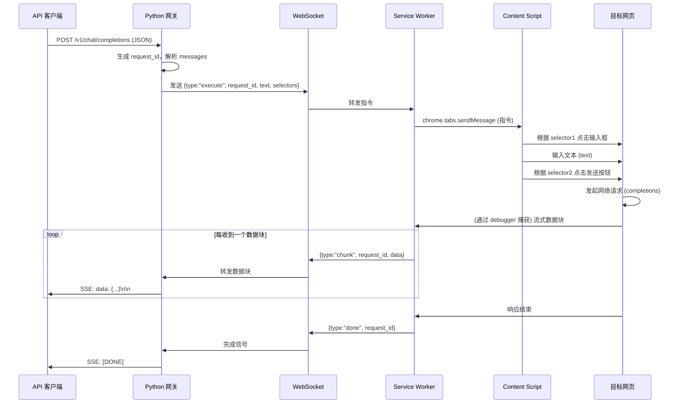

# 项目方案结构化文档

## 1. 项目概述
**项目名称**：`OpenAI-Proxy-via-Browser`（暂定）

**目标**：构建一个本地 API 网关（Python 服务），它能接收符合 OpenAI Chat Completion 格式的 HTTP 请求，通过 WebSocket 与一个 Chrome 扩展程序通信，由扩展程序在浏览器中模拟人工操作（点击、输入），捕获目标网页（如 ChatGPT）返回的流式响应，并实时回传给网关，最终返回给原始调用方。  
**关键特性**：
- 无需 API Key，完全依赖浏览器交互。
- 支持流式响应（Server-Sent Events）。
- 用户可自定义操作位置（通过 CSS 选择器或拖拽方框）。
- 所有通信本地化（Python 服务监听 8080 端口）。

---

## 2. 系统架构

```
+----------------+       HTTP (OpenAI API 格式)      +---------------------+
|   API 客户端   | ---------------------------------> |   Python 网关服务   |
| (curl, SDK等)  | <--------------------------------- |   (端口 8080)       |
+----------------+       SSE 流式响应                +----------+----------+
                                                                 |
                                                         WebSocket (ws)
                                                                 |
                                                         +--------v---------+
                                                         |  Chrome 扩展程序  |
                                                         |  (Manifest V3)   |
                                                         +--------+---------+
                                                                 |
                                                         +--------v---------+
                                                         |  浏览器标签页     |
                                                         |  (目标 AI 网站)  |
                                                         +------------------+
```

**组件说明**：
- **API 客户端**：任意支持 HTTP 请求的工具，发送 JSON 格式的 `/v1/chat/completions` 请求。
- **Python 网关**：核心中转服务，提供 OpenAI 兼容端点，与扩展建立 WebSocket 连接，管理会话和流式转发。
- **Chrome 扩展**：包含后台 Service Worker 和 Content Script，负责 DOM 操作和网络监听。
- **目标浏览器标签页**：已登录的目标 AI 网站（如 ChatGPT、Claude 等），扩展注入并操作之。

---

## 3. 核心组件详细设计

### 3.1 Python 网关服务
- **技术栈**：Python 3.10+，FastAPI（或 Flask），`websockets` 库，`uvicorn`。
- **暴露端点**：
  - `POST /v1/chat/completions`：符合 OpenAI API 规范，接收 `model`、`messages`、`stream` 等参数。
  - `GET /health`：健康检查。
  - `WS /ws`：WebSocket 端点，用于与扩展双向通信。
- **内部逻辑**：
  - 维护一个全局 WebSocket 连接池（通常只有一个扩展实例，但可扩展）。
  - 收到外部请求后，生成唯一 `request_id`，通过 WS 发送给扩展（附带待填充文本和操作选择器信息）。
  - 等待扩展通过 WS 返回流式数据块，每收到一块即立即通过 SSE 转发给客户端。
  - 若 `stream=false`，则收集所有块拼接后返回完整 JSON。
- **配置**：默认监听 `0.0.0.0:8080`，可通过环境变量修改。

### 3.2 Chrome 扩展程序
- **Manifest V3** 结构：
  - `manifest.json`：声明权限（`activeTab`、`storage`、`debugger`、`webRequest`、`host_permissions` 等）。
  - **Service Worker**（`background.js`）：管理 WebSocket 连接，接收来自 Python 的指令，向 Content Script 派发任务，监听网络事件并回传数据。
  - **Content Script**（`content.js`）：在目标页面上执行 DOM 操作（点击、输入）和 CSS 选择器定位。
  - **Popup 页面**（可选）：供用户设置选择器或拖拽选择，存储到 `chrome.storage`。
- **用户交互界面**：
  - 用户可通过 Popup 或 Options 页面，为“输入框”和“发送按钮”指定 CSS 选择器，或者通过拖拽方框（借助第三方库如 `interact.js`）高亮选择元素，保存选择器。
  - 设置存储于 `chrome.storage.sync`。
- **网络监听**：
  - 使用 `chrome.debugger` API 附加到当前标签页，启用 `Network` 域。
  - 监听 `Network.requestWillBeSent` 过滤出 URL 包含 `completions` 的请求，记录 `requestId`。
  - 监听 `Network.dataReceived` 和 `Network.responseReceived` 获取响应数据块，通过 WebSocket 实时转发给 Python。

---

## 4. 数据流与交互流程

### 4.1 初始化阶段
1. 用户启动 Python 服务，服务开始监听 8080 端口并启动 WS 服务器。
2. 用户打开 Chrome 浏览器，加载扩展程序，扩展自动与 Python 服务建立 WebSocket 连接。
3. 用户导航至目标 AI 网站并登录，确保页面可用。

### 4.2 单次请求处理流程


### 4.3 异常处理
- 若扩展未连接，Python 返回 503 错误。
- 若操作超时（如未捕获到请求），Python 返回超时错误，并清理状态。

---

## 5. 技术选型与依赖

| 组件 | 技术 | 说明 |
|------|------|------|
| **Python 网关** | FastAPI + uvicorn | 高性能异步框架，天然支持 WebSocket 和 SSE。 |
| **WebSocket 通信** | `websockets` 或 FastAPI 内置 | 稳定可靠。 |
| **Chrome 扩展** | Manifest V3 | 必须符合最新规范。 |
| **DOM 操作** | 原生 JavaScript | Content Script 直接操作。 |
| **选择器设置** | 用户可输入 CSS 选择器，或使用拖拽库（如 `interact.js`） | 后者更直观，但增加复杂度。 |
| **网络捕获** | `chrome.debugger` API | 能获取流式 chunk，但需要用户授权（`debugger` 权限会弹窗）。 |
| **存储** | `chrome.storage.sync` | 保存用户选择器设置。 |

---

## 6. 部署与运行

1. **Python 服务**：
   ```bash
   pip install fastapi uvicorn websockets
   uvicorn main:app --host 0.0.0.0 --port 8080
   ```

2. **Chrome 扩展**：
   - 将扩展文件夹加载为“已解压的扩展程序”（开发者模式）。
   - 确保扩展的 Service Worker 能连接到 `ws://localhost:8080/ws`。

3. **用户配置**：
   - 打开扩展 Popup，输入目标页面的“输入框选择器”和“发送按钮选择器”。
   - 或者使用拖拽选取功能保存选择器。

4. **测试**：
   ```bash
   curl -X POST http://localhost:8080/v1/chat/completions \
        -H "Content-Type: application/json" \
        -d '{"model":"gpt-4","messages":[{"role":"user","content":"Hello"}],"stream":true}'
   ```

---

## 7. 注意事项与挑战

| 挑战 | 应对方案 |
|------|----------|
| **流式 chunk 解析** | `debugger` 返回的 `data` 是 base64 编码的原始数据，需要解码并拼接，注意分块边界可能不完整。 |
| **请求匹配** | 使用 `requestId` 关联请求和响应，避免多个并发请求混淆。 |
| **并发请求** | 当前设计为单例模式，若客户端发起多个并发请求，需排队处理。可改进为多标签页或多扩展实例。 |
| **WebSocket 断线** | 实现心跳机制（ping/pong）和自动重连。 |
| **目标网站 DOM 变化** | 要求用户定期更新选择器，或增加智能降级策略（如根据 `aria-label` 等属性）。 |
| **用户授权** | `debugger` 权限需用户在首次使用时授权，且每次扩展启动可能需要重新附加。 |
| **合规性** | 目标网站（如 OpenAI）禁止自动化访问，本项目仅限个人学习研究，风险自担。 |

---

## 8. 未来扩展方向
- **多浏览器标签页支持**：不同请求可分配到不同标签页，提高并发能力。
- **更智能的选择器**：基于 AI 自动识别输入框和按钮，减少用户配置。
- **日志与监控**：添加请求日志、性能监控界面。

---

## 9. 当前实现状态（0.1.0 MVP）

仓库已包含可运行的最小可行实现：

- **Python 网关**（`server/`）：FastAPI 应用，OpenAI 兼容的 `POST /v1/chat/completions`（流式 + 非流式）、`GET /v1/models`、`GET /health`、WebSocket 端点 `WS /ws`。
- **Chrome 扩展**（`extension/`）：Manifest V3，包含 Service Worker、Content Script、MAIN world 注入脚本、Popup 界面与图标。
- **网络捕获双通道**：默认通过 `injected.js` 在主世界拦截 `fetch` / `XMLHttpRequest` 提供「有数据 / 流已结束」信号；若 10 秒内无任何网络信号，自动降级挂载 `chrome.debugger` 监听请求生命周期。
- **文本真相源 = DOM**：以目标页面的可见 DOM 为唯一回答文本来源，自动定位增量最大的最深容器；用户填了响应容器选择器时以用户为准。

### 9.1 目录结构

```
OpenAI-Proxy-via-Browser/
├── server/                  # Python 网关
│   ├── main.py              # FastAPI 入口（HTTP + WebSocket 端点）
│   ├── bridge.py            # 浏览器桥接层：WS 连接池、任务会话、超时控制
│   ├── openai_compat.py     # OpenAI 兼容响应与 SSE 帧构造
│   ├── protocol.py          # 网关↔扩展消息协议与错误码
│   ├── schemas.py           # 请求体 Pydantic 模型
│   ├── config.py            # 环境变量驱动的运行时配置
│   └── requirements.txt
├── extension/               # Chrome 扩展
│   ├── manifest.json
│   ├── background.js        # Service Worker：WS 客户端、任务派发、debugger 降级
│   ├── content.js           # DOM 自动化与响应容器自动探测
│   ├── injected.js          # 主世界网络嗅探
│   ├── popup.html / popup.js / popup.css
│   └── icons/icon{16,32,48,128}.png
├── tools/make_icons.py      # 用标准库生成扩展图标
├── 可行性分析.md            # 原方案与难点分析
├── chrome扩展规范.md        # Manifest V3 规范速查
└── README.md
```

### 9.2 运行步骤

#### 启动网关

```bash
cd server
python -m pip install -r requirements.txt
python main.py            # 默认监听 0.0.0.0:8080
```

可用的环境变量（不填则取默认值）：

| 变量 | 默认值 | 含义 |
| --- | --- | --- |
| `OAP_HOST` | `0.0.0.0` | HTTP 监听地址 |
| `OAP_PORT` | `8080` | HTTP 监听端口 |
| `OAP_HEARTBEAT_SEC` | `15` | 网关主动 ping 扩展的周期（秒） |
| `OAP_HELLO_TIMEOUT_SEC` | `10` | 等待扩展握手消息的超时（秒） |
| `OAP_REQUEST_TIMEOUT_SEC` | `180` | 单次请求总超时（秒） |
| `OAP_QUEUE_WAIT_SEC` | `120` | 浏览器正忙时的最长排队时间（秒） |
| `OAP_PROMPT_MODE` | `all` | `all` 拼接全部 messages；`last_user` 只取最后一条用户消息 |
| `OAP_DEFAULT_MODEL` | `browser-proxy` | 回显给客户端的模型名 |
| `OAP_ALLOW_CORS_ANY` | `true` | 是否启用 `Access-Control-Allow-Origin: *` |

#### 安装 Chrome 扩展

1. 打开 `chrome://extensions/`，开启右上角「开发者模式」。
2. 点击「加载已解压的扩展程序」，选择本仓库的 `extension/` 目录。
3. 加载完成后，扩展会自动尝试连接 `ws://127.0.0.1:8080/ws`。

#### 第一次为某个站点配选择器

1. 打开目标 AI 网站（如 `https://chat.deepseek.com`），确认页面可用。
2. 点击扩展图标打开弹窗。
3. 把 `https://chat.deepseek.com` 设为活动标签页（弹窗会自动识别当前域名）。
4. 在 DevTools 中找到输入框和发送按钮，复制它们的 CSS 选择器，填入弹窗。
5. 「响应容器选择器」「响应请求 URL 匹配」可留空（走自动探测 / 关键词匹配）。
6. 点击「保存当前站点配置」，再点击「发送测试」即可。

> 由于 extension 已声明 `"host_permissions": ["https://*/*"]`，首次加载会弹出全局站点权限警告，同意即可。

### 9.3 接口约定

- `POST /v1/chat/completions`：完全兼容 OpenAI Chat Completions 协议，支持 `stream=true/false`。
- `GET /v1/models`：返回当前可用的模型别名列表。
- `GET /health`：返回网关与浏览器连接状态（便于调试）。
- `WS /ws`：扩展客户端 WebSocket 入口，握手消息为 `{"v":1,"type":"hello","client_id":"…"}`，之后由网关下发 `execute` 指令。
- `POST /v1/cancel/{request_id}`：向扩展下发取消指令（尽力而为）。

请求级额外头：

| 头 | 用途 |
| --- | --- |
| `X-OAP-Host: chat.deepseek.com` | 指定目标站点域名；不指定时由扩展选择当前活动标签页 |
| `X-OAP-Timeout: 300` | 覆盖单次请求的总超时（秒），范围 5~3600 |

### 9.4 命令行联调

非流式：

```bash
curl -X POST http://127.0.0.1:8080/v1/chat/completions \
  -H "Content-Type: application/json" \
  -H "X-OAP-Host: chat.deepseek.com" \
  -d '{"model":"browser-proxy","messages":[{"role":"user","content":"你好"}]}'
```

流式：

```bash
curl -N -X POST http://127.0.0.1:8080/v1/chat/completions \
  -H "Content-Type: application/json" \
  -H "X-OAP-Host: chat.deepseek.com" \
  -d '{"model":"browser-proxy","stream":true,"messages":[{"role":"user","content":"讲个笑话"}]}'
```

### 9.5 已知限制（MVP 阶段）

- **MV3 Service Worker 会被回收**：纯 WebSocket 方案存在 30~60 秒不可用窗口，已通过 `chrome.alarms` 兜底 + Popup / Content Script 持久连接保活；长期稳定使用建议改用 Native Messaging（后续版本）。
- **单标签页串行**：一次只执行一个任务，新请求会按到达顺序排队，排队时间受 `OAP_QUEUE_WAIT_SEC` 限制。
- **文本源仅 DOM**：网络通道仅用于结束判定；如需做严格的 token 级流式（如打字机效果 + 复制按钮），后续可启用 `textSource: 'network'` 并为每个站点配置 JSON 提取路径。
- **`chrome.debugger` 警告横幅**：仅在降级路径下出现，会占用浏览器顶部一行（无法通过 API 抑制，只能在启动浏览器时加 `--silent-debugger-extension-api`）。
- **响应容器自动探测是启发式**：极端页面结构下可能选错容器，建议在弹窗里手动指定。

# 仅供学习，请勿用于商业用途，出事概不负责